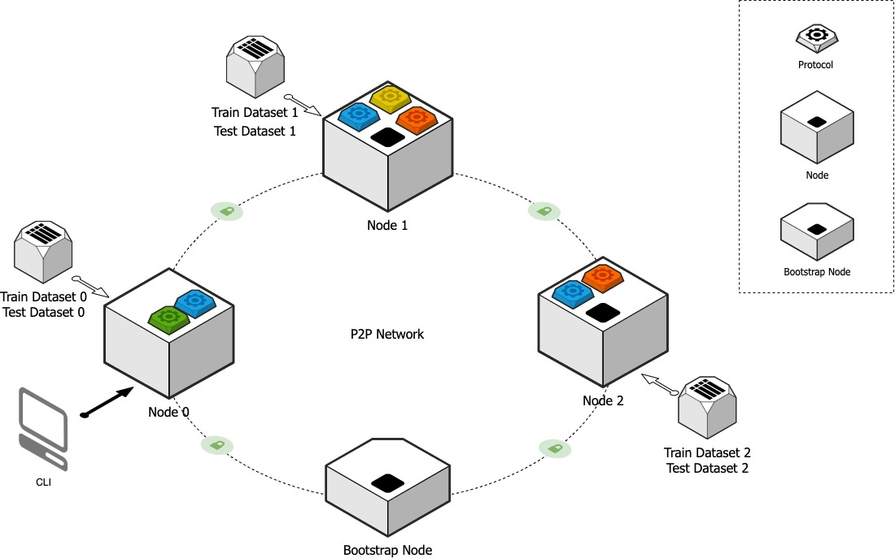

# Primihub 

[](https://gitter.im/primihub/community?utm_source=badge&utm_medium=badge&utm_campaign=pr-badge)
## 特性
 Primihub是一个支持多方计算、联邦学习、隐私求交(PSI)、隐私查询(PIR)特性的平台，支持数据源接入、数据消费、接入应用、语法、语义、安全协议多方面的扩展。 具体请见 Primihub [核心特性](http://docs.primihub.com/docs/category/%E6%A0%B8%E5%BF%83%E7%89%B9%E6%80%A7)

## 快速开始

5分钟运行起来一个MPC应用


安装[docker](https://docs.docker.com/install/overview/)和[docker-compose](https://docs.docker.com/compose/install/)

下载代码并切换到代码根路径

```
$ git clone https://github.com/primihub/primihub.git
$ cd primihub
```


## 运行一个MPC案例



### 启动节点
 

 *** 启动测试用的节点 *** 
   
   使用docker-compose 启动三个docker容器。
   容器包括：启动点、三个节点

  ```bash
  $ docker-compose up
  ```

查看运行起来的docker容器：

```bash
$ docker ps
```
```
  CONTAINER ID   IMAGE                                COMMAND                  CREATED          STATUS          PORTS                                                                         NAMES
cf875c1280be   primihub-node:1.0.5                  "/bin/bash -c './pri…"   11 minutes ago   Up 11 minutes   0.0.0.0:12120-12121->12120-12121/tcp, 0.0.0.0:8052->50050/tcp                 node2_primihub
6a822ff5c6f7   primihub-node:1.0.5                  "/bin/bash -c './pri…"   11 minutes ago   Up 11 minutes   0.0.0.0:10120->12120/tcp, 0.0.0.0:10121->12121/tcp, 0.0.0.0:8050->50050/tcp   node0_primihub
11d55ce06ff0   primihub-node:1.0.5                  "/bin/bash -c './pri…"   11 minutes ago   Up 11 minutes   0.0.0.0:11120->12120/tcp, 0.0.0.0:11121->12121/tcp, 0.0.0.0:8051->50050/tcp   node1_primihub
68befa6ab2a5   primihub/simple-bootstrap-node:1.0   "/app/simple-bootstr…"   11 minutes ago   Up 11 minutes   0.0.0.0:4001->4001/tcp                                                        simple_bootstrap_node

```                                                   


### 创建一个MPC任务

*** 让三个节点共同执行一个多方安全计算（MPC）的逻辑回归任务 ***


```bash
$ docker run --network=host -it primihub/primihub-node:1.0.5 primihub-cli --server=127.0.0.1:8050
```

> 💡 请求任务的节点
>  
> 你可以向计算集群中任意一个节点请求计算任务
>

> 💡 可用的任务参数
> 
> 通过primihub-cli可以指定以下参数
>  1. 请求哪个节点启动任务
>  2. 使用哪些共享数据集
>  3. 做什么样的隐私计算任务
 
在这个例子中primihub-cli会使用默认参数向 *** node 0 *** 请求一个ABY3的三方逻辑回归测试任务，关于cli可以指定的参数请见  *** [创建任务]([http://docs.primihub.com/docs/advance-usage/create-tasks](https://docs.primihub.com/docs/category/%E5%88%9B%E5%BB%BA%E4%BB%BB%E5%8A%A1)) ***


## 进阶使用
  想了解如何从原生应用启动以及关于如何利用Primihub的特性，实现更多应用，见 [进阶使用](http://docs.primihub.com/docs/category/%E8%BF%9B%E9%98%B6%E4%BD%BF%E7%94%A8)

## 开发者
  * 关于如何编译，请见[编译](http://docs.primihub.com/docs/developer-docs/build)
  * 关于如何贡献代码，请见 [Primihub开源社区治理](http://docs.primihub.com/docs/primihub-community)
