# PrimiHub

> English | [中文](README.md)

## Introduction

PrimiHub is a platform that supports Multi-Party Computing (MPC), Federated Learning (FL), Private set intersection (PSI), and Private Information Retrieval (PIR). It also supports extensions of data source access, data consumption, access application, syntax, semantics, and security protocols. For more details, please refer to PrimiHub [core feature](https://docs.primihub.com/docs/developer-docs/core-concept/model).

## Framework

## Quick start

Start with docker-compose, please refer to [here](https://docs.primihub.com/docs/advance-usage/start/quick-start)

Start with binary file, please refer to [here](https://docs.primihub.com/docs/advance-usage/start/start-nodes)

Start with source code, please refer to [here](https://docs.primihub.com/docs/advance-usage/start/build)

## Run tasks

Run MPC tasks, please refer to [here](https://docs.primihub.com/docs/advance-usage/create-tasks/mpc-task)

Run FL tasks, please refer to [here](https://docs.primihub.com/docs/category/%E8%81%94%E9%82%A6%E5%AD%A6%E4%B9%A0fl%E4%BB%BB%E5%8A%A1)

Run PSI tasks, please refer to [here](https://docs.primihub.com/docs/advance-usage/create-tasks/psi-task)

Run PIR tasks, please refer to [here](https://docs.primihub.com/docs/advance-usage/create-tasks/pir-task)

## Advanced usage

To learn how to start from native applications and how to use PrimiHub features to implement more applications, see [Advanced Usage](https://docs.primihub.com/docs/developer-docs/core-concept/model/)

## Contributing

If you want to contribute to this project, feel free to create an issue at our [Issue](https://github.com/primihub/primihub/issues) page (e.g., documentation, new idea, and proposal). 
Also, you can learn about our community [PrimiHub Open Source Community Governance](https://docs.primihub.com/docs/developer-docs/primihub-community) 
This is an active open-source project, and we are always open to everyone who wants to use this platform or contribute to it. 

## Community

* Wechat Official Account:

## LICENSE

This code is released under Apache 2.0, as found in the [LICENSE](https://github.com/primihub/primihub/blob/develop/LICENSE) file.
